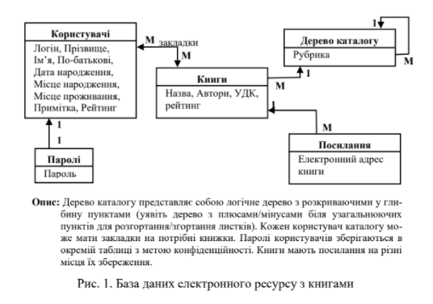

# BookResourceDb
##Summary
1. According to the variant of the task (see the table) to implement the database without
foreign keys, fill tables with data, create the specified
saved software constructs (saved procedures, user functions, triggers) and check their functions.
accuracy and correctness of their work. MS SQL Server orMySQL (student's choice).
2. Based on the results of the work performed, draw up a report and submit it.
   The report should contain the following information:
- ER-diagram of the database with extended table view (column name,
  data type, null / not null);
- Tables with completed data.
- Code of saved software constructions. To everyone
  of the saved object to give an example of its use (with
  performance results);
- Conclusion.
- 
##Variant
  Database of electronic resource with books (Fig. 1).
  ###SAVED PROCEDURES
1. Ensure parameterized insertion of new values ​​in
   table Users.

2. Create a package that inserts 10 ribbons into the Position table in the
   mother <Noname + No>, for example: Noname5, Noname6, Noname7, etc.

3. Using the cursor, ensure the dynamic creation of the database
   with Usernames, with a random number of tables for
   each database (from 1 to 9). The structure of the tables is arbitrary. Names
   tables correspond to the name of the User with the serial number
   from 1 to 9.
   ###CUSTOM FUNCTIONS
4. For the Users table, write the function as it will search
   MAX Column Rating. Then make a data sample (SELECT),
   using this function.
5. Write a function that extracts the key between the tables
   Catalog tree and Books value field Heading. Then
   make a sample of all data (SELECT) from the table Books,
   using this function.
   ###TRIGGERS
6. Ensure the integrity of the values ​​for the database structure.
7. Value Users → Rating should be within [0; 5],
   the data type allows only two digits after the comma;
8. for Book → UDC provide format: 2 arbitrary letters + '.' + 3 digits.
9. Disable deleting ribbons from the Passwords table.

